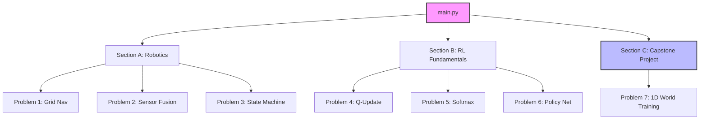
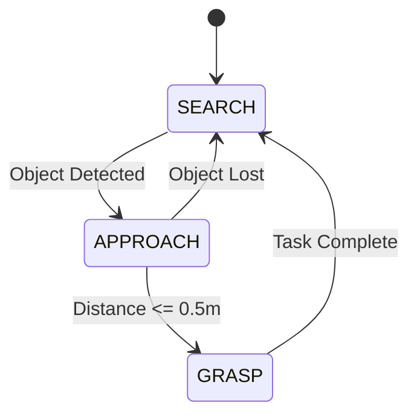

# 🤖 Intelligent Systems Algorithm — Robotics & RL Project

[](https://www.python.org/)
[](https://numpy.org/)
[](https://opensource.org/licenses/MIT)

## 📋 Overview

A comprehensive implementation of core concepts in **Intelligent Systems**, ranging from robotics control loops and sensor fusion to advanced reinforcement learning algorithms. This project serves as a final capstone, demonstrating both theoretical understanding and practical implementation.

### 🚀 Key Features

*   **⚡ Robotics & Agents**: Grid-based navigation, weighted sensor fusion, and robust Finite State Machines.
*   **🧠 RL Fundamentals**: Implementation of Bellman-based Q-Learning, Softmax exploration, and Policy Networks from scratch.
*   **🔭 Capstone Project**: A complete end-to-end RL agent training in a 1D environment with performance visualization.

---

## 🛠 Project Architecture

The project is modularly structured to separate concerns between different domains of intelligent systems.



---

## 📂 File Structure

```bash
Final_Parejas/
├── main.py            # 🚀 Entry point: Sequentially executes all sections
├── section_a.py       # 🤖 Robotics: Grid navigation, Sensor fusion, FSM
├── section_b.py       # 💡 RL Theory: Q-learning logic, Softmax, Policy Nets
├── section_c.py       # 🏆 Capstone: Integrated Q-learning training loop
├── utils.py           # 🛠 Shared utilities and helper functions
├── requirements.txt   # 📦 Project dependencies (NumPy)
└── README.md          # 📖 Project documentation (Internal)
```

---

## ⚙️ Setup & Installation

### 1. Prerequisites
Ensure you have **Python 3.8+** installed.

### 2. Environment Setup
```bash
# Create and activate virtual environment
python -m venv venv
source venv/bin/activate  # Mac / Linux
# venv\Scripts\activate   # Windows

# Install dependencies
pip install -r requirements.txt
```

### 3. Execution
```bash
python main.py
```

---

## 🔍 In-Depth Logic

### Section A: Finite State Machine (Problem 3)
The robot transitions between three distinct states to complete a task.



### Section B: Q-Learning Update
We implement the core temporal difference learning formula:
$$Q(s, a) \leftarrow Q(s, a) + \alpha [r + \gamma \max_{a'} Q(s', a') - Q(s, a)]$$

### Section C: Capstone Visualization
The agent learns to navigate a 1D world. Below is a conceptual representation of the learning progress:

| Phase | Description | Result |
| :--- | :--- | :--- |
| **Exploration** | High $\epsilon$, random moves | Long episodes, variable rewards |
| **Learning** | $\epsilon$ decaying, Q-table updating | Steps per episode decreasing |
| **Convergence** | Low $\epsilon$, exploitation | Direct path to goal (9 steps) |

---

## 👨‍💻 Developed By
**Arron Kian Parejas**

---

## 📜 Acknowledgments
*   **Gemini**: Planning & Technical Documentation
*   **Claude**: Algorithm Implementation & Logic
*   **ChatGPT**: Debugging & Error Handling
*   **VSCode**: Primary IDE